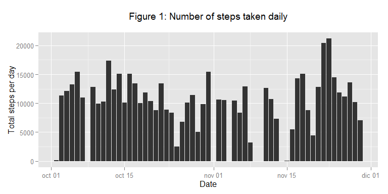
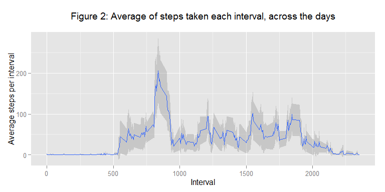
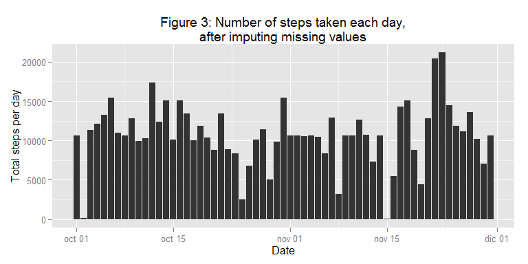
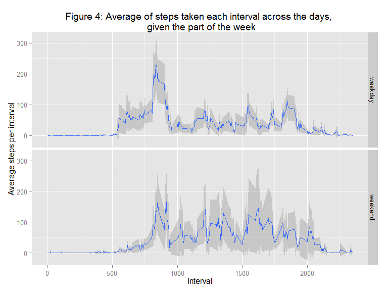

# Reproducible Research: Peer Assessment 1

---------

## Loading and preprocessing the data

```r
# Load the plotting package `ggplot2` by Hadley Wickham.
# Try to install the package if it is not found.
if(!suppressMessages(require(ggplot2))){ 
    print('trying to install ggplot2')
    install.packages('ggplot2')
    if(suppressMessagesrequire(ggplot2)){
        print("ggplot2 installed and loaded")
    } else {
        stop("could not install ggplot2")
    }
}

# Define some options for knitr
knitr::opts_chunk$set(tidy=FALSE, fig.path='figures/')

# Load provided data (use relative paths)
activity <- read.csv(file = './data/activity.csv', stringsAsFactors = FALSE)

# Change class for the date variable
activity$date <- as.Date(activity$date)
```

The data was provided in a csv file, with three columns representing: the number of steps (`steps`), the date (`date`) and a label for the 5 minute interval (`interval`). Missing values in `steps` where coded as NA and dates were coded in the 'YYYY-MM-DD' format. Follows a sample of the data.


```r
head(activity)
```

```
##   steps       date interval
## 1    NA 2012-10-01        0
## 2    NA 2012-10-01        5
## 3    NA 2012-10-01       10
## 4    NA 2012-10-01       15
## 5    NA 2012-10-01       20
## 6    NA 2012-10-01       25
```


#### Discrepancy in the data
I expected the data to contain a maximum of 288 intervals per day (*i.e.* 12 five minute intervals per hour, since each hour has 60 minutes). Each day contained up to 288 intervals, but the labels of the intervals reach up to 2355 (suggesting that there are more minutes than expected); given the jumps in interval labels (*e.g.* from 55 to 100, 155 to 200, *etc.*), it would appear it is a labeling issue (maybe a convention to start each hour on a multiple of 100, begining with 0). No mention of this was included in the PA1 instructions, so I note the discrepancy here and continue with the analysis as requested (without modifying the data).


---------

## What is mean total number of steps taken per day?


```r
# Summarize the data by day
daily_activity <-
  aggregate(formula = steps~date, data = activity,
            FUN = sum, na.rm=TRUE)

# Calculate summary statistics
mean_steps <- round(mean(daily_activity$steps), 2)  # Mean
median_steps <- quantile(x = daily_activity$steps, probs = 0.5)  # Median, 50%Q
```

The number of steps taken daily by the subject are represented in the **figure 1** below. The subject took a mean of 10766.19 and a median of 10765 steps per day.


```r
# Plot the total number of steps per day.
# Use ggplot2 to summarize de data, to
# find inconsistencies with the analysis.
histogram <- 
qplot(x=date, y=steps,
      data=subset(activity, complete.cases(activity)),
      stat='summary', fun.y=sum, geom='bar') +
  labs(title='Figure 1: Number of steps taken daily\n',
       y='Total steps per day', x='Date')
plot(histogram)
```

 

---------

## What is the average daily activity pattern?


```r
# Aggregate the steps per interval, calculating the mean across the days
interval_activity <- 
  aggregate(formula=steps~interval, data=activity,
            FUN=mean, na.rm=TRUE)
# Get the data for the interval with the most average activity across the days
max_steps <- interval_activity[which(interval_activity$steps==max(interval_activity$steps)),]
```

The daily activity was recorded as the number of steps taken during each 5 minute interval in the day; each day's data starts with interval `0`. The interval labeled 835 (the 104th interval of each day) contains the maximum number of steps (206.1698113), averaged across all days. **Figure 2** below shows the average number of steps taken during each interval, across the days (blue line); the shaded area represents the normal 95% confidence interval, used as a reference in the "missing value imputation" section.


```r
# Function to calculate de mean and normal 
# 95% confidence interval around it
mean_ci <- function(data){
    m <- mean(data)
    data.frame(y=m,
               ymin = m-(1.96*sd(data)/sqrt(length(data))),
               ymax = m+(1.96*sd(data)/sqrt(length(data))))
}

# Plot the average number of steps per interval.
# Use ggplot2 to summarize de data, to
# find inconsistencies with the analysis.
# Geom 'line' is equivalent to 'type="l"' in plot.
steps_per_interval <- 
qplot(x=interval, y=steps,
      data=subset(activity, complete.cases(activity)),
      geom='smooth', stat='summary', fun.data=mean_ci) +
  labs(title='Figure 2: Average of steps taken each interval, across the days\n',
       y='Average steps per interval', x='Interval')

steps_per_interval
```

 

---------

## Imputing missing values


```r
# Count the number of NAs
total_NAs <- sum(!complete.cases(activity))
step_NAs <- sum(is.na(activity$steps))

# Calculate the number of missing dates
dates_in_range <- seq.Date(from = min(activity$date),
                           to = max(activity$date),
                           by='1 day')
date_NAs <- sum(!activity$date[complete.cases(activity)] %in% dates_in_range)
```

The provided data contains a total of 2304, from which 2304 are missing number of steps, and none are missing dates or interval labels (*i.e.* all missing values are listed explicitly). As described in the PA1 instructions, the absence of these values might have an impact on the activity estimations; follows a description of the strategy I propose to fill in all the missing values in the dataset.

### Imputation strategy
From the observations of total steps taken per day and average steps taken per interval, it seems that there is more variation between the number of steps taken day to day (Figure 1, above) than in the average of steps taken during each interval across the different days (Figure 2, above). Given this, the imputation strategy I will follow is to complete the missing cases using the average number of steps from the corresponding interval (rounded towards zero to avoid using fractional steps).


```r
# Use previously calculated means
interval_activity$imputed_steps <- floor(interval_activity$steps)

# Merge the replacement values
imputed_activity <- merge(activity,
                          interval_activity[,c('interval', 'imputed_steps')],
                          by='interval')

# Replace the missing values
imputed_activity$steps <- ifelse(is.na(imputed_activity$steps),
                                 imputed_activity$imputed_steps,
                                 imputed_activity$steps)

# Remove unnecesary data
imputed_activity$imputed_steps <- NULL
```


```r
# Summarize the data by day
daily_imputed_activity <-
  aggregate(formula = steps~date, data = imputed_activity,
            FUN = sum, na.rm=TRUE)

# Calculate summary statistics
mean_imputed_steps <- round(mean(daily_imputed_activity$steps), 2)
median_imputed_steps <- quantile(x = daily_imputed_activity$steps, probs = 0.5)
```

After imputing the data with the devised strategy, the number of daily steps show a mean of 1.074977 &times; 10<sup>4</sup> (less than 1 percent of variation from the original mean) and a median of 1.0641 &times; 10<sup>4</sup> (around 1 percent of variation from the original median). From these observations, it seems that the impact of imputing missing values on the total number of daily steps is negligible, so probably the original estimates have little bias due to missing values. The histogram of total number of daily steps, with imputed missing values, is included in Figure 3:


```r
# Replace the data in the original histogram with the imputed data
histogram %+% imputed_activity +
  labs(title='Figure 3: Number of steps taken each day,\nafter imputing missing values')
```

 


---------

## Are there differences in activity patterns between weekdays and weekends?

The PA1 instructions suggested using the `weekdays()` function to assign the "weekday" and "weekend" levels. Since the result of that function is locale specific (giving the weekday names in the language of that locale), it is not reproducible across locales which use different languages (*e.g.* U.S.A. versus Latinamerica). A locale-agnostic approach is to use the `format()` function, which is in fact used by the `weekdays()` method for objects of class `Date`:


```
## weekdays.Date <-
## function (x, abbreviate = FALSE) 
## format(x, ifelse(abbreviate, "%a", "%A"))
```

but using the conversion specification '%u', which returns the weekday as a number, starting with 1 for Monday.

Since the PA1 instructions describes creating de weekday/weekend plot based on the "simulated" data, I used for this section the data completed in the previous section. From Figure 4 below, it seems that there is overall less activity on the weekends, and it also starts later in the day.


```r
# Label each date as weekday/weekend (1:5 are weekdays, 6:7 are weekends)
imputed_activity$week_part <- factor(
  ifelse(as.integer(format(imputed_activity$date, format = '%u')) %in% c(1:5),
         'weekday', 'weekend'))

# Plot the average steps per interval, given the week_part
steps_per_interval %+% imputed_activity + facet_grid(week_part~.) +
  labs(title='Figure 4: Average of steps taken each interval across the days, \n given the part of the week')
```

 


---------
  
## Information about the analysis environment
  
Follows information on the R session used for this analysis.


```r
# Record R session info
si <- sessionInfo()

# Privacy matters
si$locale <- '... [removed for privacy purposes, irrelevant to this analysis]'

# Show it
si
```

```
## R version 3.1.1 (2014-07-10)
## Platform: i386-w64-mingw32/i386 (32-bit)
## 
## locale:
## [1] ... [removed for privacy purposes, irrelevant to this analysis]
## 
## attached base packages:
## [1] stats     graphics  grDevices utils     datasets  methods   base     
## 
## other attached packages:
## [1] ggplot2_1.0.0
## 
## loaded via a namespace (and not attached):
##  [1] colorspace_1.2-4 digest_0.6.4     evaluate_0.5.5   formatR_1.0     
##  [5] grid_3.1.1       gtable_0.1.2     htmltools_0.2.6  knitr_1.8       
##  [9] labeling_0.3     MASS_7.3-33      munsell_0.4.2    plyr_1.8.1      
## [13] proto_0.3-10     Rcpp_0.11.3      reshape2_1.4     rmarkdown_0.3.3 
## [17] scales_0.2.4     stringr_0.6.2    tools_3.1.1      yaml_2.1.13
```
